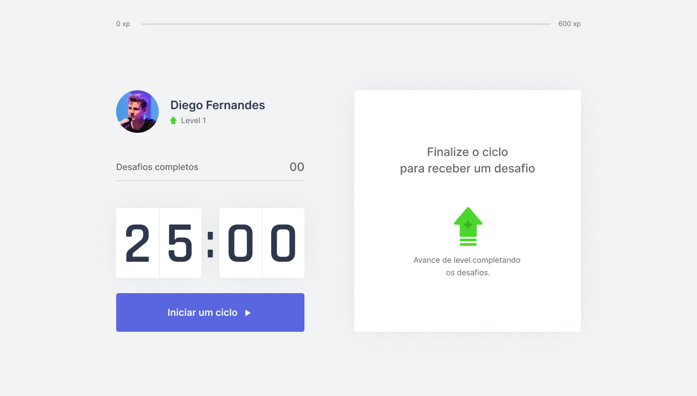

Site desenvolvido em [Next.js](https://nextjs.org/)

## Para Clonar o repositório

No terminal execute o seguinte código:

```bash
git clone https://github.com/Shynjy/moveit-dev-nextjs.git 'nome do clone do repositório'
```

## Getting Started

Para rodar o servidor do projeto em local:

```bash
npm run dev
# or
yarn dev
```

Abra seu navegador na seguinte url [http://localhost:3000](http://localhost:3000) e confira o resultado.

## Learn More

To learn more about Next.js, take a look at the following resources:

- [Next.js Documentation](https://nextjs.org/docs) - learn about Next.js features and API.
- [Learn Next.js](https://nextjs.org/learn) - an interactive Next.js tutorial.

You can check out [the Next.js GitHub repository](https://github.com/vercel/next.js/) - your feedback and contributions are welcome!

## Deploy no site da Vercel

The easiest way to deploy your Next.js app is to use the [Vercel Platform](https://vercel.com/new?utm_medium=default-template&filter=next.js&utm_source=create-next-app&utm_campaign=create-next-app-readme) from the creators of Next.js.

Check out our [Next.js deployment documentation](https://nextjs.org/docs/deployment) for more details.
